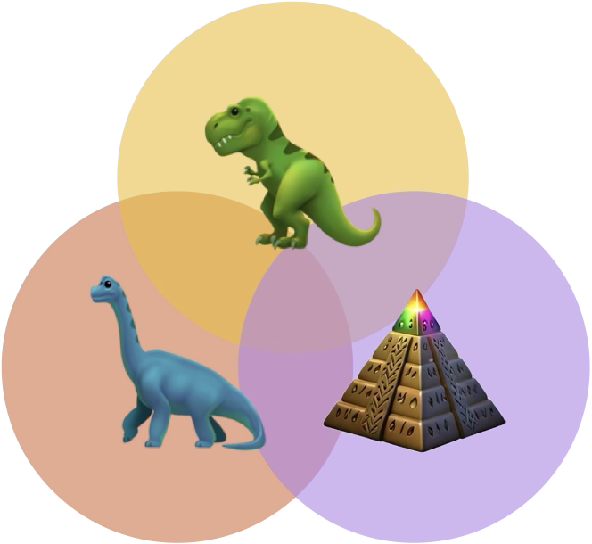

<h1 align="center">
    <div style="display: flex; align-items: center; justify-content: center;">
        <div style="flex: 0 0 18%; text-align: center;">
            
        </div>
        <div style="flex: 0 0 82%; text-align: left;">
            <em>Geometry Meets Vision</em>: <br />
            <span style="font-size: xx-large;"> Revisiting Pretrained Semantics in Distilled
                Fields </span>
        </div>
    </div>
</h1>
<p align="center"> 
    <span class="author-block"><a 
    href="https://may0mei.github.io/">
        Zhiting&nbsp;Mei*</a>
    </span>,
    <span class="author-block"><a href="#">Ola&nbsp;Shorinwa*</a></span>,
    <span class="author-block"><a
        href="https://irom-lab.princeton.edu/majumdar/">
        Anirudha&nbsp;Majumdar</a>
    </span>
                
</p>
<p align="center">
    <sup>&#42;</sup>Equal Contribution.
</p>
<p align="center">
  <a href="">
    
  </a>
  <h4 align="center">
    <a href="https://spine-geo.github.io/">Project Page</a> 
    | <a href= "#">arXiv (Coming Soon)</a>
  </h4>
  <div align="center"></div>
</p>

<br>

Semantic distillation in radiance fields has spurred significant advances in open-vocabulary robot policies, e.g., in manipulation and navigation, founded on pretrained semantics from large vision models. While prior work has demonstrated the effectiveness of visual-only semantic features (e.g., DINO and CLIP) in Gaussian Splatting and neural radiance fields, the potential benefit of geometry-grounding in distilled fields remains an open question.
In principle, _visual-geometry_ features seem very promising for spatial tasks such as pose estimation, prompting the question: _Do geometry-grounded semantic features offer an edge in distilled fields?_
Specifically, we ask three critical questions:

1. Does spatial-grounding produce higher-fidelity geometry-aware semantic features?
2. Does geometry-grounding improve semantic object localization?
3. Does geometry-grounding enable higher-accuracy radiance field inversion?

Given the limitations of prior work and their lack of semantics integration, we propose a novel framework **SPINE** for inverting radiance fields without an initial guess, consisting of two core components: (i) coarse inversion using distilled semantics, and (ii) fine inversion using photometric-based optimization.

Surprisingly, we find that the pose estimation accuracy _decreases_ with geometry-grounded features. Our results suggest that visual-only features offer greater versatility for a broader range of downstream tasks, although geometry-grounded features contain more geometric detail. Notably, our findings underscore the necessity of future research on effective strategies for geometry-grounding that augment the versatility and performance of pretrained semantic features.

## Installation Instructions

The installation instructions assumes you have installed [VGGT](https://github.com/facebookresearch/vggt) and [Nerfstudio](https://docs.nerf.studio/quickstart/installation.html) from source. Please refer to the [setup guide](setup.md) for more details.

### 1. Clone this repo.

`git clone git@github.com:flowdqn/spine.git`

### 2. Install `spine` as a python package.

cd into either `spine-gsplat` or `spine-nerf`, then run
`python -m pip install -e .`

## 3. Register `spine` with Nerfstudio.

`ns-install-cli`

### Now, you can run `spine` like other models in Nerfstudio using the `ns-train spine` command.

### For example:

```python
ns-train spine --data <path to the data> \
    --output-dir <path to the output directory>
```

### To train your radiance field. You can run:

```bash
bash bash_scripts/submit_train_rad_field_example.bash
```

from the base directory.

### To evaluate the trained radiance field. You can run:

```bash
bash bash_scripts/eval_rad_field_example.bash
```

from the base directory.

_You can replace the `sbatch` command with `bash` in any of the bash scripts to run without slurm._
